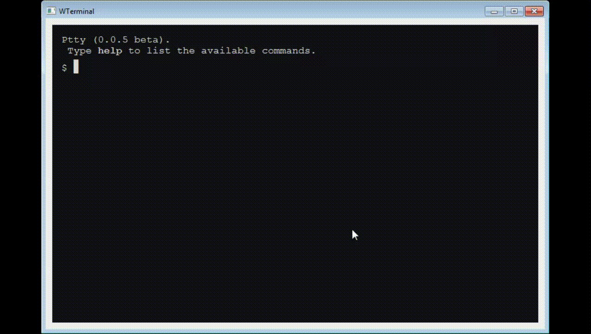
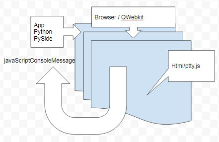

# genericshelltoolboxpython
Generic Shell Toolbox in Python the display on html terminal emulation ( multi platform )

This project provide a toolbox to make an app shell terminal with command are write in python as plugin class in cmds directory  

# Archi 

Dependencies:
* python 
* pyside
* PySide.QtWebKit

html/js

* jquery 
* simplelightbox

### Command 
* clear internal of js ptty
* ls 

### Todo 
A lot of thing
