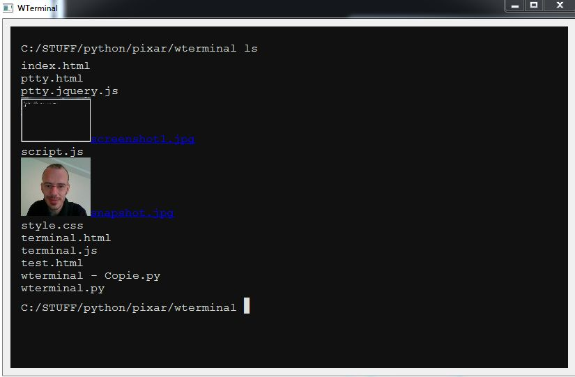

# genericshelltoolboxpython
Generic Shell Toolbox in Python the display on html terminal emulation ( multi platform )

This project provide a toolbox to make an app shell terminal with command are write in python as plugin class in cmds directory  

Ls : Display image.

Dependencies:
* python 
* pyside
* PySide.QtWebKit

html/js

* jquery 
* simplelightbox
