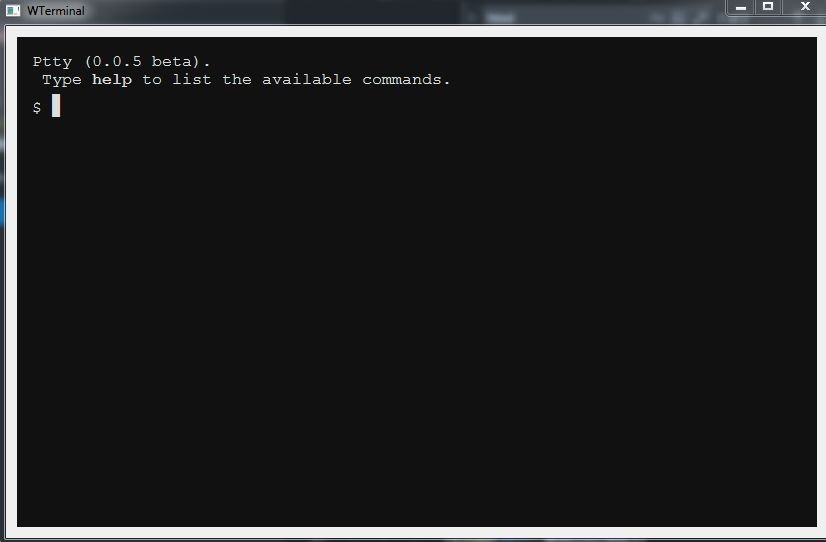

# genericshelltoolboxpython
Generic Shell Toolbox in Python the display on html terminal emulation ( multi platform )

Dependencies:
* python 
* pyside
* PySide.QtWebKit

html/js

* jquery 
* simplelightbox
